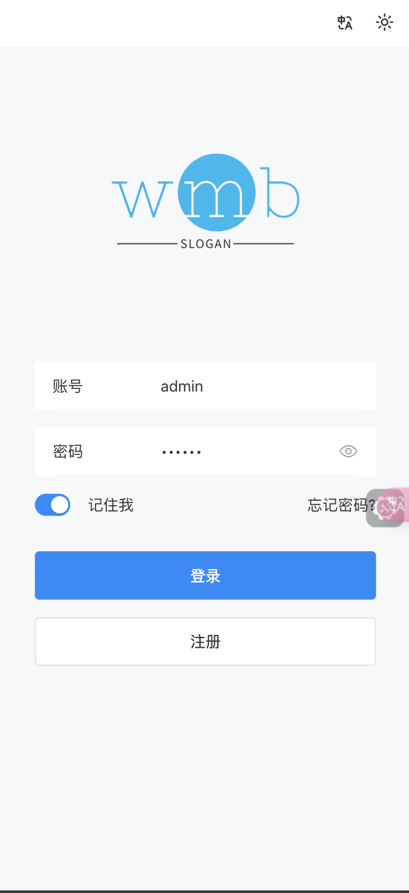
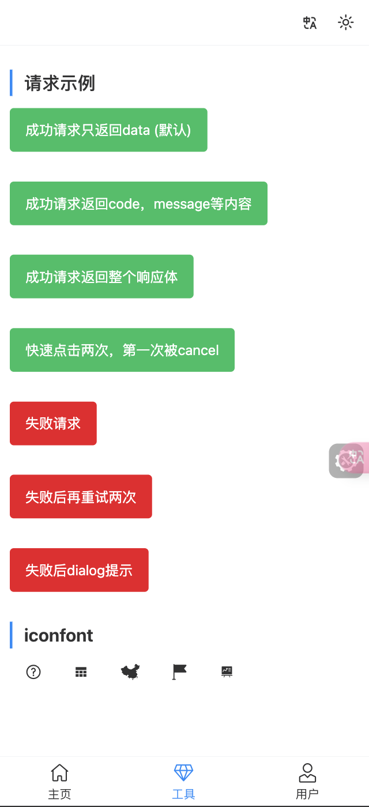
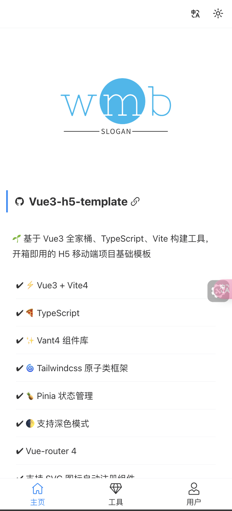

<div align="center">
	
</div>

<h1 align="center">Vue3 h5 template</h1>

**🌱 基于vue3、vite4、tailwindcss、vant、vue-i18n、pinia、vue-hooks-plus、eslint、commitlint的h5开发模版**

- [x] Vue3 + Vite4
- [x] TypeScript
- [x] Vant4 组件库
- [x] Tailwindcss 原子类框架
- [x] Pinia 状态管理、状态持久化
- [x] 支持深色模式
- [x] Vue-router 4
- [x] 支持 SVG 图标自动注册组件、iconfont注册，自动下载
- [x] vw 视口适配
- [x] Axios 封装支持取消、重试等
- [x] 打包资源 gzip 压缩
- [x] 开发环境支持 Mock 数据
- [x] ESLint
- [x] 首屏加载动画
- [x] 开发环境调试面板
- [x] 生产环境 CDN 依赖
- [x] 国际化多语言


## 快速启动

```shell
git clone https://github.com/wmb0412/vue3-h5-template.git

cd vue3-h5-template

pnpm install && pnpm dev
```

## 项目截图
<div align="center" style="display: flex; justify-content: space-between; background-color: #f1f1f1;padding: 20px">
	
  
	
</div>


## 鸣谢

 [vue3-h5-template](https://github.com/yulimchen/vue3-h5-template)

 [vue-vben-admin](https://github.com/vbenjs/vue-vben-admin)

